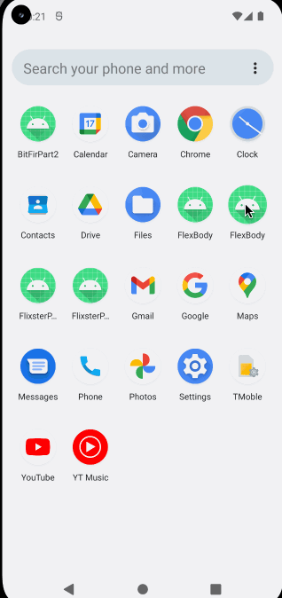

# FlexBody

## Table of Contents

1. [Overview](#Overview)
1. [Product Spec](#Product-Spec)
1. [Wireframes](#Wireframes)

**Demo Video link:** https://youtu.be/lqTYdpPZ5eA 

## Overview

### Description

FlexBody is a mobile fitness application that allows users to track exercise and nutrition data on their fitness journey. Users will be able to keep track of information in lists so they can quickly bring up information on the go: gym or market. Users will be able to share their gains by taking pictures and revisiting them at any point in time.

### App Evaluation

- **Category:** Health and Fitness
- **Mobile:** Mobile is essential for posting, easy creation of lists, and camera use. Users will be able to take photos when exercising or at the gym and post to their feed. 
    - Keywords: Camera Support, Usability at the gym, casual, easy-to-use
- **Story:** Helps users to log their fitness information by compartmentalizing exercise and nutrition data into lists. With stretch features implemented the app becomes a social hub for those exercising by allowing users to see recent creations and messaging.
- **Market:** Per [Statista.com](https://www.statista.com/statistics/1154994/number-us-fitness-health-app-users/#:~:text=In%202019%2C%20there%20were%2068.7,apps%20in%20the%20United%20States.), it was forecasted that there would be 86.3 million users of health or fitness apps in the United States. In 2019, there were 68.7 million smartphone owners that used _at least_ one health or fitness app. Therefore, this app is targeted towards any Android smartphone owner that is interested in a fitness and wellbeing app.
- **Habit:** As the user continues to create lists and post images, the app can serve as a reminder of their fitness journey. With stretch features, users would be able to see other users' posts and chat with fellow fitness enthusiasts. Serving as a social app would be conducive to having users checking in the app more frequently.
- **Scope:** V1 will allow users to create accounts and create lists for exercises and nutrition. They will be able to use the camera app to take pictures. V2 and beyond would be stretch feature implementations. V2 would allow users to start seeing other users posts on their feed and allowing interactions with emojis. It would also move the main feed for displaying the user information to a separate profile feed. V3 would incorporate messaging between users.

## Product Spec

### 1. User Features (Required and Optional)

**Required Features**

* [x] [R1] User can register an account
* [x] [R2] Users will be able to log in
* [x] [R3] User sees a home screen with a bottom navigation menu
    * [x] Navigation menu is stylized
    * [x] Bottom navigation links to respective fragments
* [x] [R4] User can submit pictures of them exercising
* [x] [R5] User can search for exercises to add to exercise list
    * [x] Create exercise list fragment (search for exercises)
    * [x] API returns exercises from Public endpoint
* [x] [R6] Users have a personal feed
    * [ ] Users can see the titles of their created lists(CUT FROM THIS BUILD)
    * [x] Users can see their image uploads
 * [ ] [R7] User can search for nutrition information to add to nutrition list
    * [ ] Create exercise list nutrition (search for nutrition)
    * [ ] API returns nutrition from Public endpoint

**Stretch Features**

* [x] [S1] Users will see a splash screen when app is booted
* [ ] [S2] Users will receive a daily notification to check the app
* [ ] [S3] Users will like or "flex" images or exercise lists
* [ ] [S4] Users will can save other users exercise lists
* [x] [S5] Users can search exercises returned from API
    * [x] A searchbar is implemented
* [x] [S6] User can log out
* [ ] [S7] Users can see a feed of recently created lists/uploaded images
    * [x] A user feed fragment is implemented
    * [ ] User should be able to see the titles of recent lists created from all users
    * [x] User should be able to see recent images of all users
* [ ] [S8] User can favorite lists of other users
    * [ ] A favorite list fragment is implemented
* [ ] [S10] Users see graph or dashboard metrics
### 2. Screen Archetypes

- [S1] Splash Screen
    - Displays the app logo and/or name while the app loads.
- [R1, R2] Login/Registration Screen
    - Allows ussers to log in to their account or create a new account
- [R3] Home Screen with Bottom Navigation Menu
    - Displays metrics and data visualizations related to the user's exiercise and nurtition habits
    - Displays the main content of the app, with a bottom navigation menu that links to different fragments within the app.
- [S7] User Feed Screen
    - Shows a feed of recently created exercise lists and uploaded images from all users.
- [R5] Create Exercise List Screen
    - Allows users to search for exercises and add them to their personal exercise list.
- [R7] Create Nutrition List Screen
    - Allows users to search for nurtition information and add it to their personal nutrition list.
- [R4, R6] Feed Screen
    - Shows a feed of the user's own uploaded images and other's feed
- [S8] Favorite List in Profile
    - Displays a list of the user's favorite exercise and nurtition lists created by other users.

### 3. Navigation

**Tab Navigation** (Tab to Screen)

* Home Tab (Home Screen)
* Exercise Tab (Create Exercise List Screen)
* Nutrition Tab (Create Nutrition List Screen)
* Personal Tab (Personal Plan Screen)
* Feed Tab (Feed Screen)

**Flow Navigation** (Screen to Screen)

- Splash Screen
- Login/Registration Screen
- Home Screen with Bottom Navigation Menu
  - Home Tab (Home Screen)
      - View exercise and nutrition metrics
  - Exercise Tab (Create Exercise List Screen)
  - Nutrition Tab (Create Nutrition List Screen)
  - Personal Tab (Personal Feed Screen)
  - Favorite Tab (Favorite List Screen)
- Create Exercise List Screen
  - Search for exercises
  - Add exercise to list
- Create Nutrition List Screen
  - Search for nutrition information
  - Add nutrition to list
- Personal Plan Screen
  - View personal exercise and nurtition lists
- User Feed Screen
  - Upload exercise images
  - View recently uploaded exercise images
  - Like or "flex" images or lists
  - Save other users' exercise lists
- Logout

## Wireframes

### [BONUS] Digital Wireframes & Mockups

### [BONUS] Interactive Prototype

### Build Progress: Video Walkthrough

Here's a walkthrough of implemented user stories:

| Milestone #2: April 17, 2023 | Milestone #3: April 24, 2023 | Milestone #4: May 1, 2023 |
| --- | --- | --- | 
| |   |  | 
